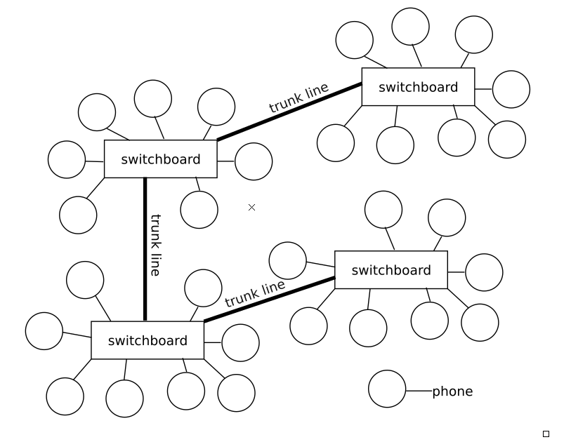

# RetrieverBell-> Phone_Network

# Project Description

Because of a new surprise round of antitrust cases, a new phone company RetrieverBell was created.  You've been hired as the single programmer whose duty is to code the connection servers for all of the phones signed up with your company.  

Like the old days before cell phones, phones will have an area code, which is permitted to be any positive number of digits and a phone number, which is permitted to be any positive number of digits.  

In order to connect a phone to another phone, if it's a local number in the same area code, it can connect through its local switchboard.  On the other hand, if it's a long distance number, it has to connect through the connected switchboards.  

# A Sample Diagram of Our Network

Trunk lines allow us to connect between switchboards and each phone is connected to exactly one switchboard (and has exactly one area code).  

In our network, there is a 1-to-1 correspondence between switchboards and area codes.  (I.e. each switchboard has one area code attached, and that area code is fully handled by that board.)

****************************For more details see -> Project_Description.pdf ***************************